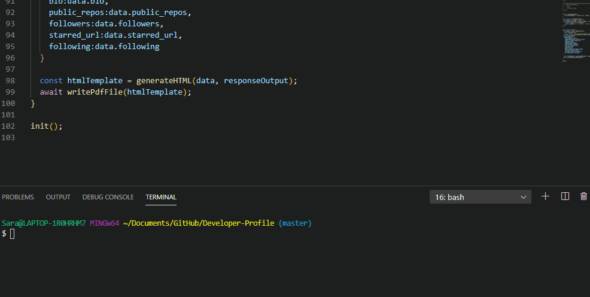

## Developer Profile
***
In this program, the user will be able to *personalize* their own *developer profile*.  They first can choose a favorite color (green, blue, pink or red). Next, the user can enter their Github username to retrieve data.  Then, the user will be provided with a link to a pdf created that displays their current Github user data.  Dependencies used here are, inquirer, axios, and html_pdf.

### Links:
https://github.com/SDamyan/Developer-Profile
 https://sdamyan.github.io/Developer-Profile/

### GIF:

